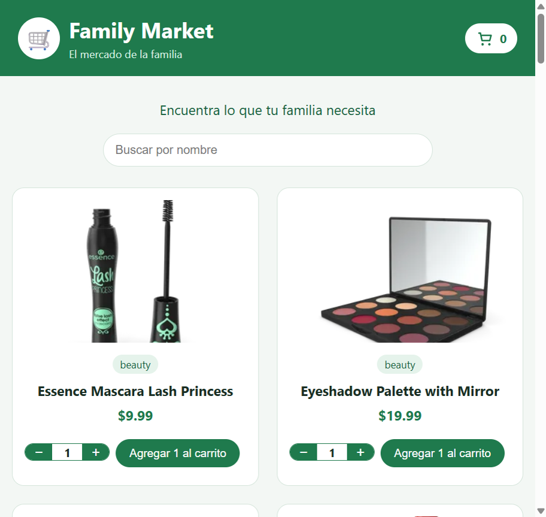
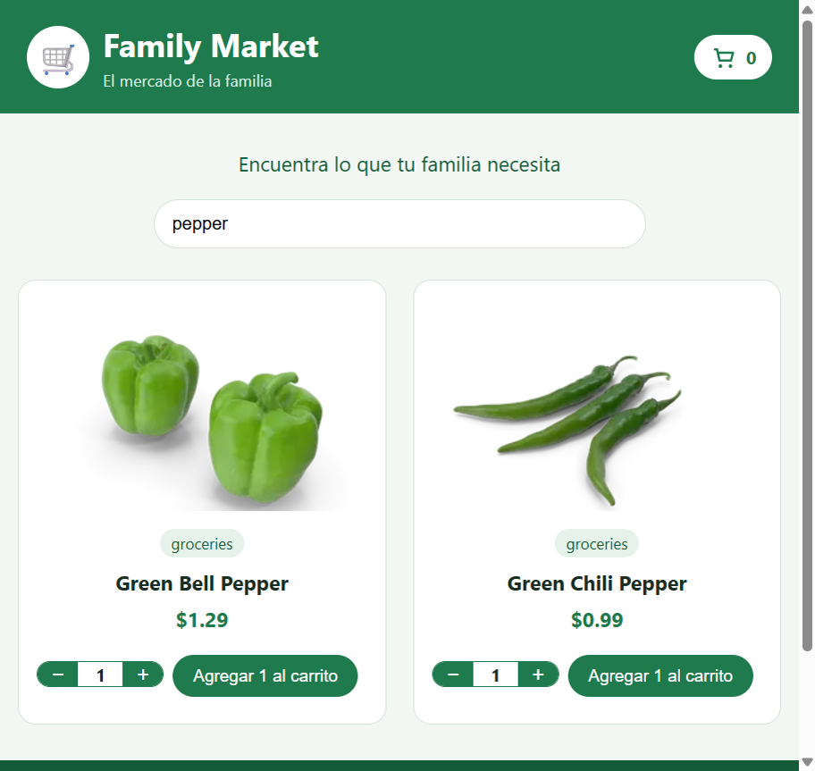

# Family Market

E-commerce familiar hecho con React. Muestra productos que llegan desde una API pública, se pueden buscar por nombre y se pueden agregar al carrito.

## Descripción

Proyecto de e-commerce con consumo de API. La pantalla se arma como un Lego: cada pieza tiene un trabajo, y `App.jsx` las junta.

Al abrir la tienda, `App` pide los productos a [DummyJSON](https://dummyjson.com/products) con `fetch` dentro de `useEffect`. Mientras llegan se ve el **Loader**. Si la API falla, se ve **ErrorMessage**. Si todo sale bien, se muestra la lista.

DummyJSON entrega `title`, `price`, `category` y `thumbnail`. Antes de pintarlos, los pasamos a `name` e `image` para que las tarjetas usen los mismos nombres de siempre.

La búsqueda se guarda con `useState` en `App` y filtra por nombre (con o sin acento).

## Componentes

Cada componente vive en su propia carpeta dentro de `src/components/`, con su archivo `.jsx` y su archivo `.css` al lado.

- **Header**: logo, nombre de la tienda y botón del carrito.
- **SearchBar**: caja de búsqueda. Recibe `value` y `onChange` por props (datos que le pasa el padre).
- **ProductList**: recorre el array con `.map()` y usa `key={product.id}`.
- **ProductCard**: recibe el producto por **props** y muestra imagen, categoría, nombre, precio, cantidad y botón.
- **Loader**: círculo que gira mientras llegan los productos.
- **ErrorMessage**: aviso si la API no responde.
- **QuantitySelector**: botones + y − para elegir cuántas unidades comprar.
- **Button**: botón reutilizable. Cambia de aspecto según `variant` (`primary` o `secondary`).
- **Cart**: cuadrito con lo que llevas y el botón Compra aquí.
- **Footer**: datos de la tienda (nombre y ciudad).

## Cómo ejecutar

En la carpeta del proyecto:

```bash
npm install
npm run dev
```

`npm install` descarga las herramientas que el proyecto necesita (como ir a comprar los ingredientes).

`npm run dev` enciende el servidor local. Abre en el navegador la URL que muestre Vite, por ejemplo `http://localhost:5173`.

Hace falta internet para que DummyJSON entregue los productos.

## Tecnologías

- React
- Vite
- JavaScript
- CSS
- API DummyJSON (`https://dummyjson.com/products`)

## Capturas

### Vista general

La tienda completa: encabezado, buscador, grilla de productos y pie de página.



### Búsqueda

Al escribir `pepper` en el buscador, solo quedan los productos que tienen esa palabra en el nombre.


